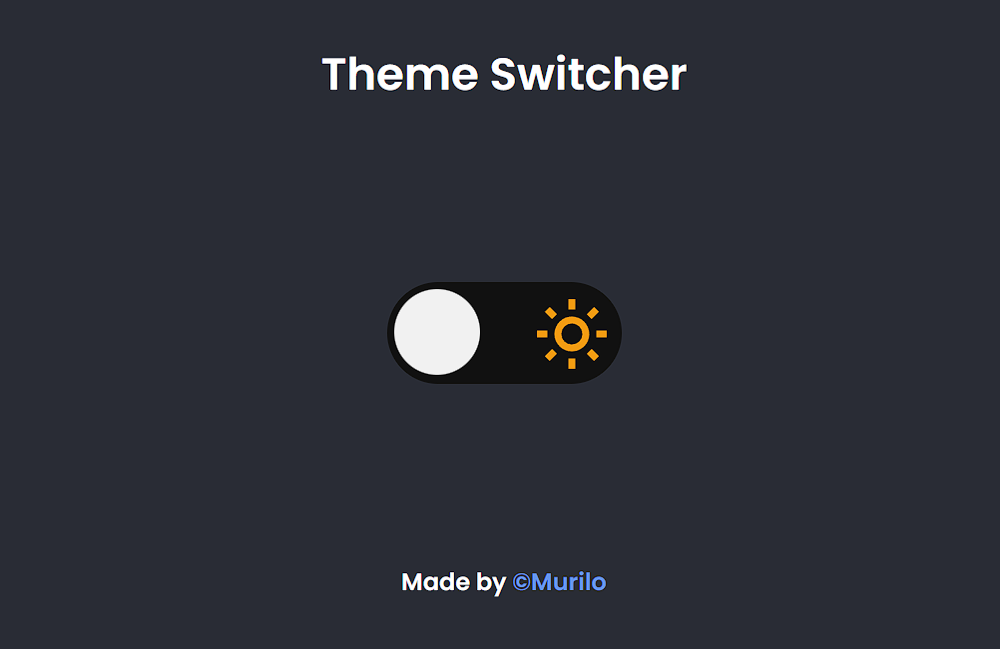

<h1 align="center">Theme Switcher</h1>

  <a href="#-tecnologias">Tecnologias</a>&nbsp;&nbsp;&nbsp;|&nbsp;&nbsp;&nbsp;
  <a href="#-projeto">Projeto</a>&nbsp;&nbsp;

 

  

 

## 🚀 Tecnologias

Esse projeto foi desenvolvido com as seguintes tecnologias:

- HTML e CSS
- JavaScript
- DOM
- Git e Github

## 💻 Projeto

Projeto Alternador de temas (muda de tema black para white)

---

Feito por @MURILO